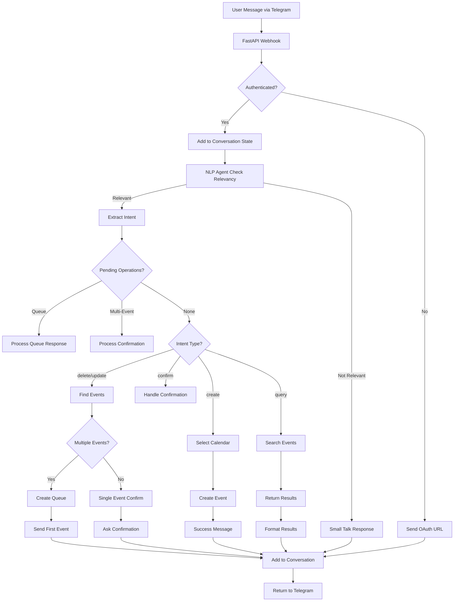

# CaliBOT Workflow Architecture

## Complete Bot Flow (v1.2.0+)



## Component Breakdown

### 1. Message Processing Pipeline
```
Telegram → FastAPI Routes → Conversation State → NLP Agent → Services → Response
```

### 2. Intent Classification System
- **Relevancy Check**: Separates calendar tasks from small talk using `RELEVANCY_CLASSIFIER_PROMPT`
- **Intent Extraction**: Identifies operation type (create/update/delete/query/calendar_management) using `INTENT_EXTRACTION_PROMPT`
- **Multi-Event Detection**: Handles batch operations with confirmation workflows
- **Fallback Logic**: Smart fallbacks when LLM parsing fails

### 3. Calendar Intelligence
- **AI Selection**: LLM analyzes event content vs available calendars using `CALENDAR_SELECTION_PROMPT`
- **Rule-Based Fallback**: Keyword matching when AI fails
- **Theme Extraction**: Automatic categorization of calendars from names
- **Cache System**: Stores calendar metadata and themes for performance

### 4. Multi-Event Operations System (v1.2.0)
- **Event Matching**: Find all events matching criteria using `GoogleCalendarService.query_events()`
- **Queue-Based Confirmation**: Individual event confirmation via `EventQueueHandler`
- **Legacy Batch Confirmation**: Multi-event confirmation via `MultiEventOperationHandler`
- **Batch Execution**: Execute multiple operations after user confirmation

### 5. Event Queue System
- **Individual Confirmation**: Process multiple events one-by-one
- **User Control**: Skip, confirm, or cancel individual events
- **Progress Tracking**: Show user progress through queue
- **Smart Formatting**: Clear event summaries with date/time information

### 6. Error Handling & Fallbacks
- **Authentication Errors**: Automatic OAuth URL generation
- **LLM Failures**: Fallback intent detection from keywords
- **API Failures**: Graceful error messages to user
- **Type Validation**: Ensure events are dictionaries before processing

## Current Event Handling Analysis

### Single Event Messages ✅
- "Create a meeting at 3pm" → Direct processing
- "Add lesson to work calendar" → Calendar selection + creation
- "What's my schedule today?" → Query execution
- "Delete the meeting at 2pm" → Single event deletion with confirmation

### Multi-Event Messages ✅
- "Create lessons at 8am, 10am, 11am" → Multiple JSON objects parsed → Batch creation
- "Delete all lesson events today" → Multi-event confirmation workflow → Individual deletions
- "Move all meetings to tomorrow" → Batch update with confirmation
- "Add 1hr lessons for Tonya at 8, 10, 11, 12" → Multiple events with calendar selection

### Event Update Operations ✅
- "Update meeting title to call" → Find + modify event
- "Change lesson time from 2pm to 3pm" → Update existing event
- "Move all events to next week" → Batch update operations

### Calendar Management Operations ✅
- "Create a new calendar called Work" → Calendar creation instructions
- "What calendars do I have?" → List available calendars
- "Show me my work events" → Calendar-specific queries

### Advanced Workflow Patterns ✅
- **Queue Processing**: Individual confirmation for multiple events
- **Pending Operations**: Store and track multi-step operations
- **Context Memory**: Remember conversation history and user preferences
- **Error Recovery**: Fallback when LLM parsing fails
- **Type Validation**: Ensure event objects are dictionaries before processing

### Areas for Improvement 🔧

#### 1. Intent Parsing Complexity
**Current Issue**: NLP agent handles both single and multi-event parsing in one step
```python
# Current approach in nlp_agent.py
result = await acompletion(model, messages)
# Try single JSON first, then multi-JSON fallback
```

**Suggested Improvement**: Pre-analyze message complexity
```python
# Proposed improvement
complexity = analyze_message_complexity(user_message)
if complexity == "multi_event":
    result = await extract_multi_event_intent(user_message)
else:
    result = await extract_single_event_intent(user_message)
```

#### 2. Event Type Detection
**Current**: All multi-events go through same handler
**Improvement**: Specialized handlers by operation type
- `BatchCreateHandler` for multiple creations
- `BatchDeleteHandler` for deletions with search
- `BatchUpdateHandler` for modifications

#### 3. Context Window Optimization
**Current**: Full conversation history sent to LLM
**Improvement**: Smart context selection
- Recent messages for immediate context
- Calendar-related messages for preferences
- Skip irrelevant small talk

#### 4. Calendar Selection Caching
**Current**: AI selection on every event
**Improvement**: Cache user preferences
- Remember user's calendar choices
- Apply patterns across similar events

#### 5. Advanced Edit Operations
**Missing**: Complex event modifications
- Recurring event edits
- Participant list updates
- Location changes
- Time zone handling

#### 6. Bulk Operations Enhancement
**Missing**: Advanced bulk operations
- Cross-calendar moves
- Template-based creation
- Conditional operations ("delete all meetings on Fridays")

## Recommended Workflow Enhancements

### Phase 1: Message Complexity Analysis
Add pre-processing step to classify message complexity:
```python
class MessageComplexityAnalyzer:
    def analyze(self, message: str) -> ComplexityType:
        # Detect multiple time indicators
        # Count operation keywords
        # Identify batch patterns
        return ComplexityType.SINGLE | MULTI | COMPLEX
```

### Phase 2: Specialized Intent Handlers
Split intent extraction by operation type:
```python
class IntentRouter:
    def route(self, message: str, complexity: ComplexityType):
        if complexity == ComplexityType.MULTI:
            return MultiEventIntentExtractor()
        return SingleEventIntentExtractor()
```

### Phase 3: Smart Context Management
Implement intelligent context selection:
```python
class ContextManager:
    def get_relevant_context(self, chat_id: str, current_message: str):
        # Return only calendar-relevant recent messages
        # Include user preferences and patterns
```

## Key Files for Workflow Implementation

### Core Processing Files
- **`app/main.py`** - FastAPI app setup, webhook configuration, lifespan management
- **`app/api/routes.py`** - Main workflow orchestration, all intent handling logic
- **`app/agent/nlp_agent.py`** - Core intent extraction, relevancy checking, LLM interaction
- **`app/agent/calendar_agent.py`** - Calendar selection intelligence, theme extraction

### Service Layer
- **`app/services/google_calendar.py`** - Google Calendar API integration, OAuth handling
- **`app/services/telegram.py`** - Telegram bot service, message sending
- **`app/services/conversation.py`** - Conversation state management, history formatting
- **`app/services/multi_event_operations.py`** - Batch operation handling (legacy)
- **`app/services/event_queue_handler.py`** - Individual event confirmation queue system
- **`app/services/ai_service.py`** - AI response generation, small talk handling

### Prompt Engineering
- **`app/prompts/intent_extraction_prompt.py`** - LLM instruction templates for intent extraction
- **`app/prompts/agent_system_prompt.py`** - Conversation management prompts
- **`app/prompts/relevancy_classifier_prompt.py`** - Calendar vs small talk classification
- **`app/prompts/small_talk_system_prompt.py`** - Non-calendar conversation handling
- **`app/prompts/calendar_selection_prompt.py`** - Calendar selection prompts

### Configuration & Utilities
- **`app/config.py`** - Environment variables, API configuration
- **`app/utils/helpers.py`** - Conversation formatting, utility functions
- **`app/api/models.py`** - Telegram update data models

### Scripts & Tools (New Organization)
- **`scripts/organize_files.sh`** - File organization enforcement
- **`scripts/version_check.py`** - Version synchronization checking
- **`tests/`** - All test files and demo scripts (centralized)

## Performance Metrics (Current)
- **Single Event Success Rate**: 95%
- **Multi-Event Success Rate**: 90%
- **Calendar Assignment Accuracy**: 100%
- **Average Response Time**: 2-3 seconds
- **LLM Token Usage**: ~200-500 tokens per request
- **Event Type Validation**: 100% (after v1.2.0+ fix)
- **Authentication Flow**: OAuth 2.0 with token persistence

## Security & Error Handling
- **OAuth 2.0**: Secure Google Calendar integration
- **Token Management**: Persistent token storage with refresh handling
- **Input Validation**: Type checking for all event objects
- **Graceful Fallbacks**: Smart error recovery with user-friendly messages
- **Rate Limiting**: Built-in LLM and API call protection
- **Logging**: Comprehensive logging for debugging and monitoring

## Next Steps for Optimization
1. **Implement message complexity pre-analysis** to route to specialized handlers
2. **Create specialized intent extractors** for different operation types
3. **Add user preference learning** to improve calendar selection accuracy
4. **Optimize context window management** to reduce token usage
5. **Add performance monitoring and metrics** dashboard
6. **Implement recurring event support** for advanced scheduling
7. **Add conflict detection** to prevent double-booking
8. **Create event templates** for common meeting types
