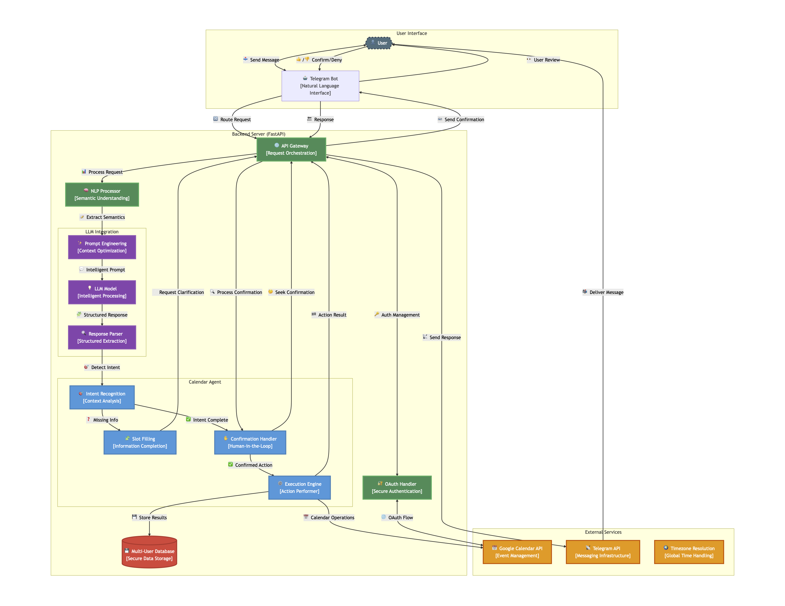

# CaliBOT 📅

CaliBOT is an intelligent Telegram bot that helps users manage their Google Calendar through natural language conversations. The bot leverages GPT-4o to understand user intents, process natural language requests, and perform calendar operations seamlessly.

## Features

- 🗓️ **Calendar Management**: Create, update, delete, and query calendar events using conversational language
- 🤖 **AI-Powered**: Utilizes GPT-4o for natural language understanding and conversation management
- 🔄 **Google Calendar Integration**: Securely connects to users' Google Calendar accounts
- 💬 **Contextual Conversations**: Maintains conversation history to provide relevant responses
- 🧠 **Intent Recognition**: Automatically identifies calendar-related requests vs. small talk
- 🔐 **Secure Authentication**: OAuth 2.0 integration with Google Calendar API

## Demo

https://github.com/user-attachments/assets/d65d8789-252c-4a87-9c47-10ba2ec6b0f1

## System Design

Diagram below depicts the sytem design. However, database is not implemented yet.



## Sequence Diagram


## Getting Started

### Prerequisites

- Python 3.10 or higher
- Google Cloud Platform account (for Calendar API access)
- Telegram Bot API token
- OpenAI API key

### Installation

1. Clone the repository:

```bash
git clone https://github.com/yourusername/calibot.git
cd calibot
```

2. Install dependencies:
   Make sure you have `uv` installed. See [here](https://docs.astral.sh/uv/) for complete information.

```bash
uv pip install
```

3. Set up environment variables:

Create a `.env` file in the root directory with the following variables:

```
TELEGRAM_API_TOKEN=your_telegram_token
OPENAI_API_KEY=your_openai_api_key
GOOGLE_CREDENTIALS_FILE=path_to_your_google_credentials.json
```

### Setting up Google Calendar API

1. Go to the [Google Cloud Console](https://console.cloud.google.com/)
2. Create a new project
3. Enable the Google Calendar API
4. Create OAuth 2.0 credentials (Web application type)
5. Download the credentials JSON file and reference it in your `.env` file

### Setting up Telegram Bot

1. Create a new bot on Telegram using [BotFather](https://t.me/botfather)
2. Get the API token and add it to your `.env` file

## Usage

1. Start the backend server:

```bash
python -m backend.app.main
```

2. Set up a tunneling service like [ngrok](https://ngrok.com/) to expose your local server (required for Telegram webhook):

```bash
ngrok http 8060
```

3. Update the `backend_url` in `backend/app/main.py` with your ngrok URL

4. Chat with your bot on Telegram:
   - Authenticate with Google when prompted
   - Use natural language to manage your calendar events

### Examples of Queries

- "Schedule a meeting with John tomorrow at 3pm"
- "What events do I have next Monday?"
- "Cancel my meeting with the design team"
- "Move my 2pm appointment to 4pm"
- "Schedule a doctor's appointment on March 15th at 10am for 1 hour"

## Architecture

The application uses:

- **FastAPI**: For the backend API
- **LiteLLM**: For AI model integration
- **Google API Client**: For Google Calendar integration
- **Python-Telegram-Bot**: For Telegram bot integration

### Key Components:

- **NLP Agent**: Extracts intent and event details from user messages
- **AI Service**: Manages conversation flow and generates responses
- **Google Calendar Service**: Handles calendar operations and authentication
- **Telegram Service**: Manages Telegram bot interactions

## Development

### Project Structure

```
calibot/
├── backend/
│   ├── app/
│   │   ├── agent/         # NLP agent for intent recognition
│   │   ├── api/           # FastAPI routes and models
│   │   ├── services/      # Core services (AI, Calendar, Telegram)
│   │   ├── utils/         # Helper utilities
│   │   ├── config.py      # Configuration settings
│   │   ├── main.py        # Application entry point
│   │   └── prompts.py     # LLM prompts
├── .python-version        # Python version specification
└── pyproject.toml         # Project dependencies
```

## Roadmap

The following features are planned for future releases:

- **Conflict Detection:** Check for overlapping events when scheduling new appointments
- **Batch Operations:** Support for deleting or updating multiple events simultaneously
- **Participant Management:** Add email lists to quickly populate event participants

## Security Considerations

- OAuth 2.0 is used for secure Google account authentication
- User tokens are stored locally and are not shared
- The application only requests necessary Calendar API permissions

## Contribution

Contributions are welcome! Feel free to open a pull request with your improvements or suggestions.

## License

[MIT License](LICENSE)
