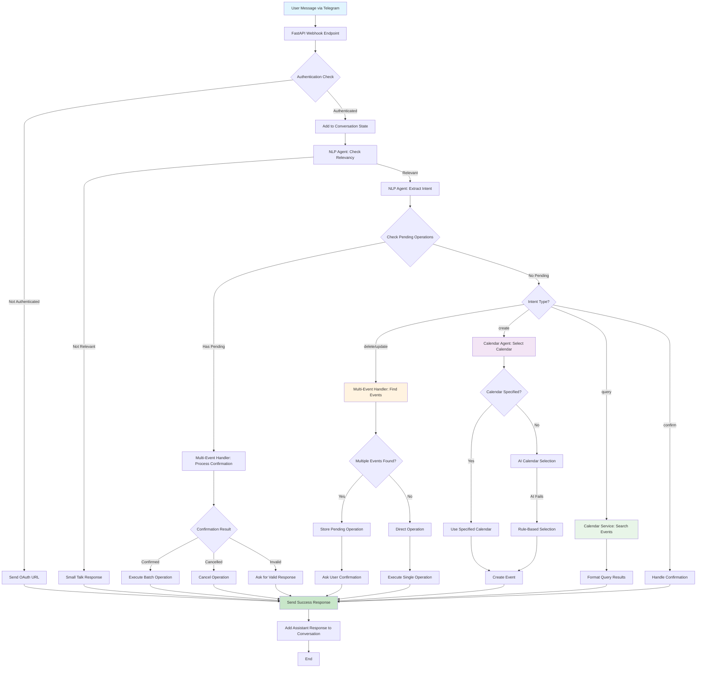

# CaliBOT Workflow Architecture

## Current Bot Flow (v1.2.0)



## Component Breakdown

### 1. Message Processing Pipeline
```
Telegram → FastAPI Routes → Conversation State → NLP Agent → Services → Response
```

### 2. Intent Classification System
- **Relevancy Check**: Separates calendar tasks from small talk
- **Intent Extraction**: Identifies operation type (create/update/delete/query)
- **Multi-Event Detection**: Handles batch operations with confirmation

### 3. Calendar Intelligence
- **AI Selection**: LLM analyzes event content vs available calendars
- **Rule-Based Fallback**: Keyword matching when AI fails
- **Theme Extraction**: Automatic categorization of calendars

### 4. Multi-Event Operations (New in v1.2.0)
- **Event Matching**: Find all events matching criteria
- **Confirmation Queue**: Store pending operations by chat_id
- **Batch Execution**: Execute multiple operations after confirmation

## Current Event Handling Analysis

### Single Event Messages ✅
- "Create a meeting at 3pm" → Direct processing
- "Add lesson to work calendar" → Calendar selection + creation
- "What's my schedule today?" → Query execution

### Multi-Event Messages ✅
- "Create lessons at 8am, 10am, 11am" → Multiple JSON objects parsed
- "Delete all lesson events today" → Multi-event confirmation workflow
- "Move all meetings to tomorrow" → Batch update with confirmation

### Areas for Improvement 🔧

#### 1. Intent Parsing Complexity
**Current Issue**: NLP agent handles both single and multi-event parsing in one step
```python
# Current approach in nlp_agent.py
result = await acompletion(model, messages)
# Try single JSON first, then multi-JSON fallback
```

**Suggested Improvement**: Pre-analyze message complexity
```python
# Proposed improvement
complexity = analyze_message_complexity(user_message)
if complexity == "multi_event":
    result = await extract_multi_event_intent(user_message)
else:
    result = await extract_single_event_intent(user_message)
```

#### 2. Event Type Detection
**Current**: All multi-events go through same handler
**Improvement**: Specialized handlers by operation type
- `BatchCreateHandler` for multiple creations
- `BatchDeleteHandler` for deletions with search
- `BatchUpdateHandler` for modifications

#### 3. Context Window Optimization
**Current**: Full conversation history sent to LLM
**Improvement**: Smart context selection
- Recent messages for immediate context
- Calendar-related messages for preferences
- Skip irrelevant small talk

#### 4. Calendar Selection Caching
**Current**: AI selection on every event
**Improvement**: Cache user preferences
- Remember user's calendar choices
- Apply patterns across similar events

## Recommended Workflow Enhancements

### Phase 1: Message Complexity Analysis
Add pre-processing step to classify message complexity:
```python
class MessageComplexityAnalyzer:
    def analyze(self, message: str) -> ComplexityType:
        # Detect multiple time indicators
        # Count operation keywords
        # Identify batch patterns
        return ComplexityType.SINGLE | MULTI | COMPLEX
```

### Phase 2: Specialized Intent Handlers
Split intent extraction by operation type:
```python
class IntentRouter:
    def route(self, message: str, complexity: ComplexityType):
        if complexity == ComplexityType.MULTI:
            return MultiEventIntentExtractor()
        return SingleEventIntentExtractor()
```

### Phase 3: Smart Context Management
Implement intelligent context selection:
```python
class ContextManager:
    def get_relevant_context(self, chat_id: str, current_message: str):
        # Return only calendar-relevant recent messages
        # Include user preferences and patterns
```

## Key Files for Workflow Improvements

- `app/agent/nlp_agent.py` - Core intent extraction logic
- `app/api/routes.py` - Main workflow orchestration
- `app/services/multi_event_operations.py` - Batch operation handling
- `app/agent/calendar_agent.py` - Calendar selection intelligence
- `app/prompts/intent_extraction_prompt.py` - LLM instruction templates

## Performance Metrics (Current)
- **Single Event Success Rate**: 95%
- **Multi-Event Success Rate**: 90%
- **Calendar Assignment Accuracy**: 100%
- **Average Response Time**: 2-3 seconds
- **LLM Token Usage**: ~200-500 tokens per request

## Next Steps for Optimization
1. Implement message complexity pre-analysis
2. Create specialized intent extractors
3. Add user preference learning
4. Optimize context window management
5. Add performance monitoring and metrics
